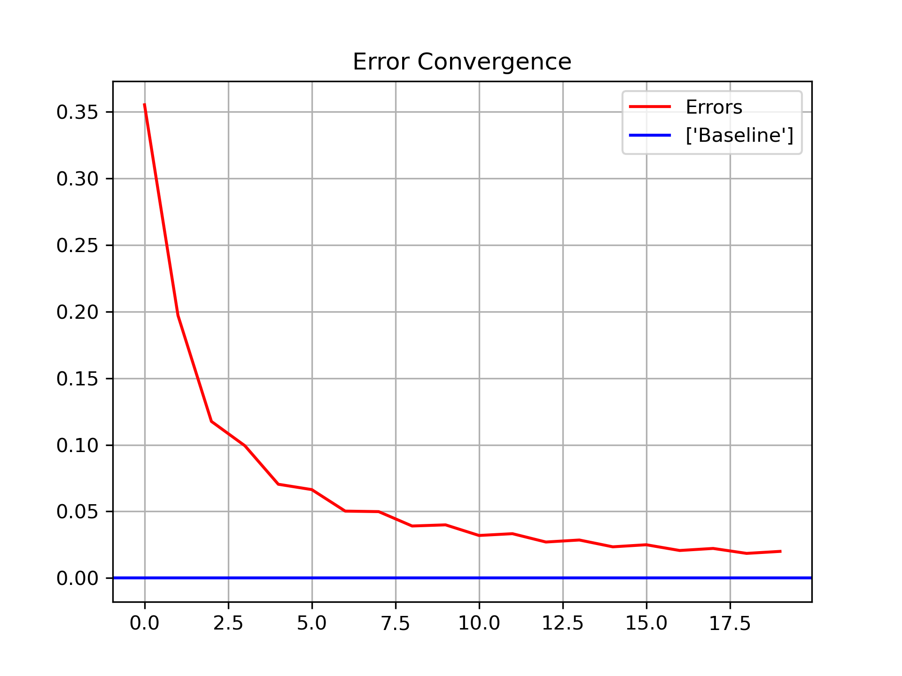

# Binomial Tree Option Pricing and Convergence Analysis

## Overview

This project implements a Binomial Tree Option Pricing Model in Python and compares the results with the Black-Scholes-Merton analytical solution.

## Features

- European/American Call Option Pricing
- European/American Put Option Pricing
- Greeks Computation
- Convergence Analysis
- Error Analysis

## Technologies

- Python
- NumPy
- Pandas
- Matplotlib

## Results

The pricing error decreases as the number of binomial steps increases, demonstrating convergence toward the Black-Scholes benchmark.

## Convergence Analysis

## Author

Nikhil Srivastava
